# 🌐 SocietyConnect

[](https://react.dev)
[](https://vitejs.dev)
[](https://spring.io/projects/spring-boot)
[](https://pingcap.com/products/tidb)
[](https://vercel.com)
[](https://render.com)

> **SocietyConnect** is a corporate-grade hyperlocal digital ecosystem that bridges the trust gap between residents, local service providers, and residential communities. Featuring automated trust-score directories, group buying economies, emergency response dispatchers, and secure dispute resolution flows, it transforms residential spaces into connected networks.

---

## 🌟 Core Value Propositions

### 🏡 For Residents
*   **Verified Marketplace**: Easily find trusted service providers sorted by security background.
*   **Secure Transactions**: Raise disputes and upload transaction screenshots for escrow-like security.
*   **Real-time Communication**: Chat directly with local providers for instant scheduling updates.

### 🛠️ For Service Providers
*   **Reputation Engine**: Build verification stars based on ratings, certifications, and completed jobs.
*   **Client Communication**: Server-Sent Events (SSE) based direct client messaging.
*   **SaaS Dashboard**: Design package pricing and manage subscription tiers.

### 🏢 For Community Management (Admins)
*   **System Auditing**: Toggle RWA, identity, and police verifications.
*   **Dispute Arbitration**: Resolve community grievances and manage network parameters.

---

## 📸 Key Features Visual Walkthrough

Below are the primary user dashboards and screens showing the clean, fluid, responsive, and neumorphic layout across different device form factors.

### Desktop Views

#### 1. Neumorphic Interactive Service Directory
The homepage presents residents with a harmonious, accessibility-compliant neumorphic dashboard to search categories, view active bookings, and review nearby recommendations.

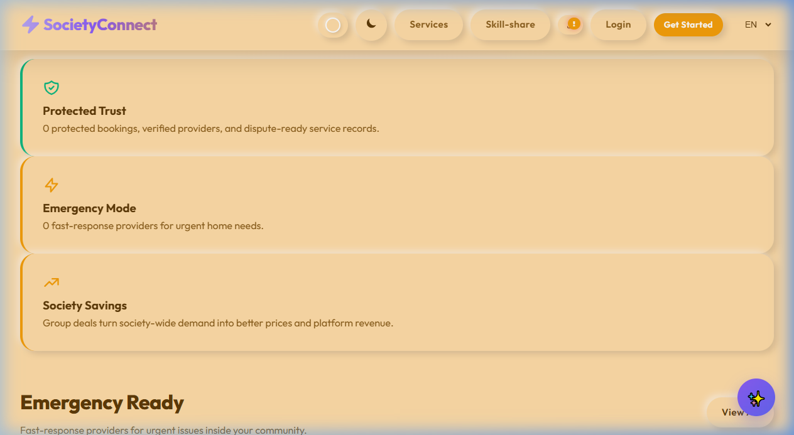

#### 2. High-Intent Directory Search & Filtering
Our search engine lists verified service providers, filtering by RWA verification status, premium tier level, and ecological practices. All search results are sorted by our dynamic Trust Score.

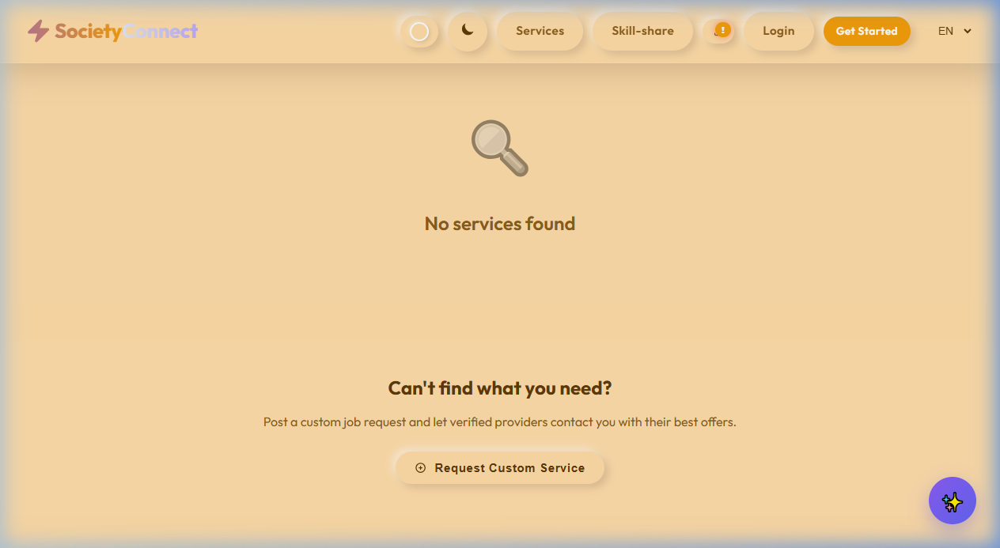

#### 3. Hyperlocal Growth Hub & Group Deals
The startup engine uses network clustering effects: residents can join group-pledges for discounted society-wide deals, while service providers can access the emergency dispatch queue.

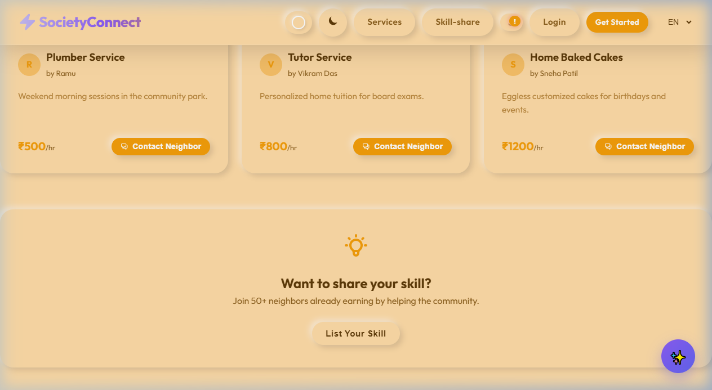

---

### Tablet Views
SocietyConnect includes responsive styling that scales to medium-sized viewports, preserving card structures, search layouts, and stat cards.

| Tablet Homepage | Tablet Search | Tablet Growth Hub |
| :---: | :---: | :---: |
| 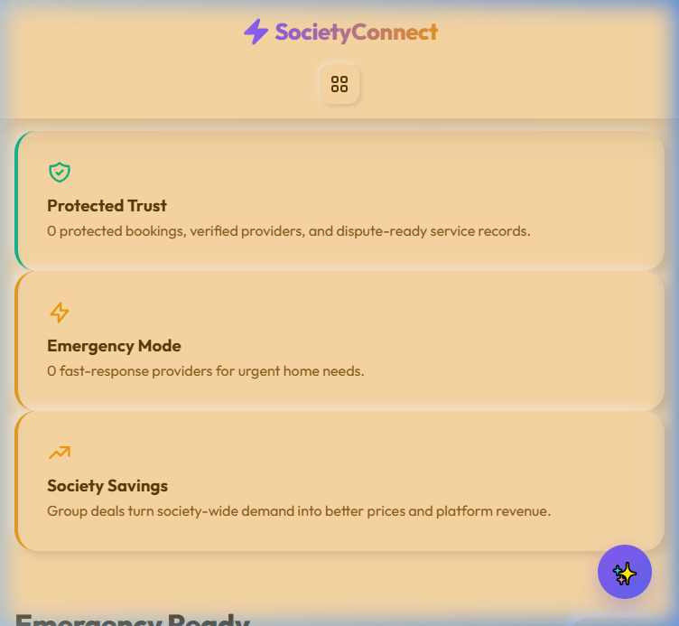 | 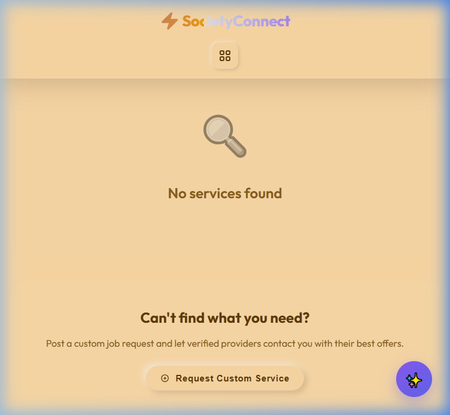 | 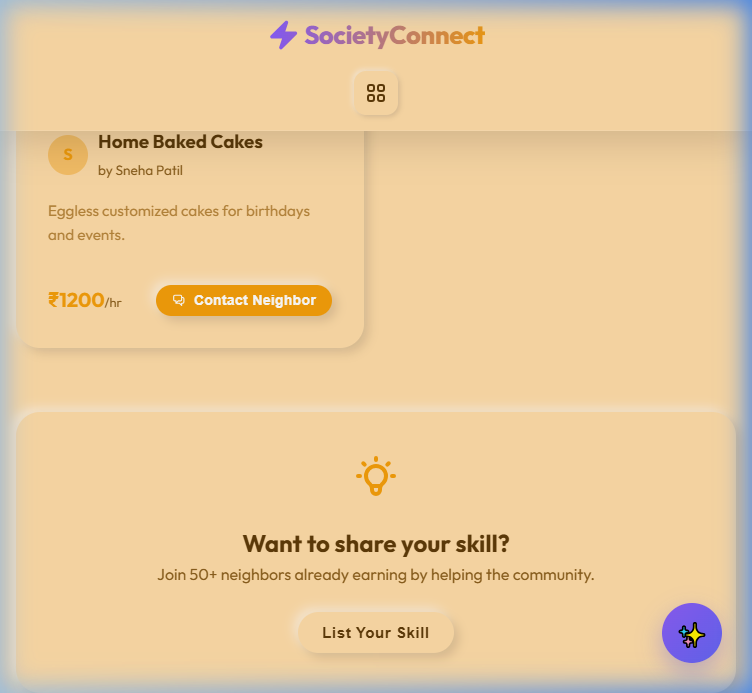 |

---

### Mobile Views
The application is fully optimized for mobile devices, offering a progressive mobile app layout with bottom navigation tabs, card slides, and swipe gestures.

| Mobile Homepage | Mobile Search Directory | Mobile Growth Hub |
| :---: | :---: | :---: |
| 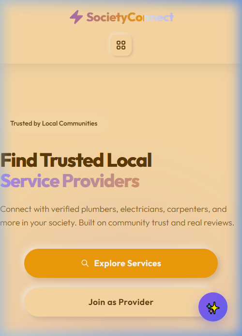 | 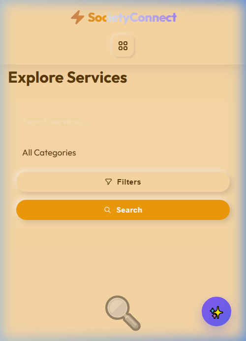 | 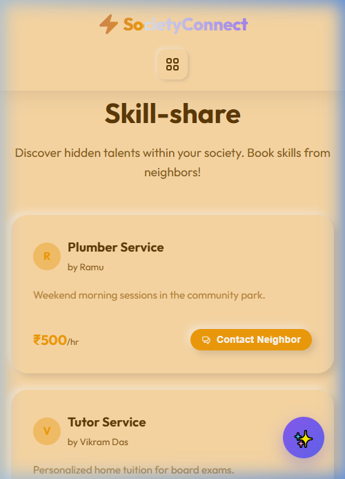 |

---

## 🏗️ Architectural Overview & Design Blueprints

### End-to-End Workflow Diagram
The following workflow details how a resident interacts with the platform to find a provider, dispatch an order, receive status updates, and finalize payment:

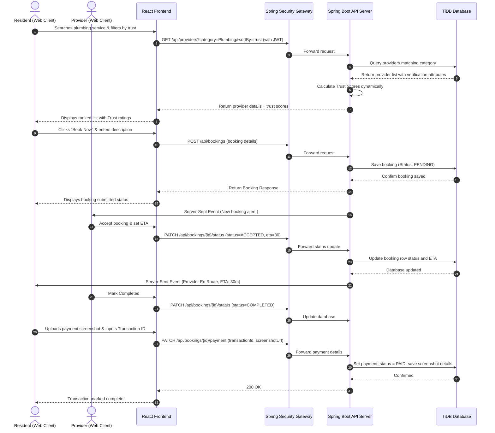

---

## 🛠️ Software Design Patterns Used

To ensure robust scalability and loose coupling, the platform employs industry-standard architectural design patterns:

### Backend Architecture Patterns
*   **Controller-Service-Repository**: Separates controllers (HTTP mapping), services (business computations like Trust Scores and mail dispatch), and repositories (database queries).
*   **Dependency Injection (IoC)**: Decouples component lifetimes, managed by Spring container beans.
*   **Data Transfer Object (DTO)**: Encapsulates incoming and outgoing JSON payloads, hiding internal database structure.
*   **Chain of Responsibility**: Processes request security checks and JWT token decoding sequentially.

### Frontend Architecture Patterns
*   **Provider Pattern (Context API)**: Propagates authentication tokens, theme values, and translation tables to deep subcomponents without prop-drilling.
*   **Container-Presenter Pattern**: Decouples UI templates (cards, tables) from API hooks and routing context managers.

For full architectural blueprints, see:
*   📘 **[High-Level Design (HLD) Document](docs/HLD.md)**: Exposes container layouts, system contexts, security workflows, and full patterns analysis.
*   📗 **[Low-Level Design (LLD) Document](docs/LLD.md)**: Exposes the database schema, dynamic trust score calculations, API tables, and class blueprints.

---

## 💾 Database Schema Overview

The database uses a serverless **TiDB Cloud** setup with the following relationships:

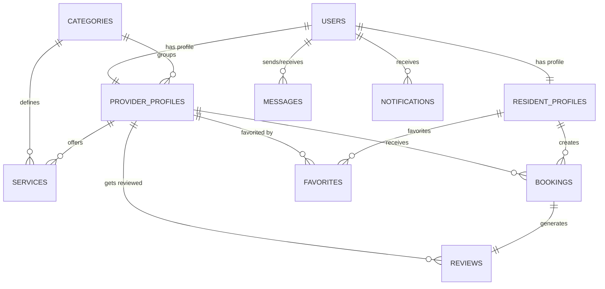

For table-by-table column configurations, constraints, data types, and indexes, refer to the **[Database Schemas Section of the LLD](docs/LLD.md#1-database-schema--relationships-er-diagram)**.

---

## 🤖 Model Context Protocol (MCP) Server Integration

The platform includes a built-in Node.js **MCP Server** that exposes the Spring Boot endpoints to local AI agents (e.g. Claude Desktop). 

1.  **Get Categories (`get_categories`)**: Exposes active service category folders.
2.  **Search Providers (`search_providers`)**: Allows AI to query provider databases.
3.  **Get Details (`get_provider_details`)**: Fetches ratings, bios, and RWA check documents.

Refer to the [MCP Server Directory](mcp-server/README.md) for Claude Desktop connection parameters.

---

## ⚙️ Development & Local Installation

### Prerequisites
*   **Java 17 SDK** (JDK)
*   **Node.js v18+**
*   **MySQL Client** or **TiDB Account**
*   **Maven 3.8+**

### Step 1: Clone the Repository
```bash
git clone https://github.com/raviattrash-pro/societyConnect.git
cd societyConnect
```

### Step 2: Database Setup (TiDB / MySQL)
1.  Create a MySQL schema named `societyconnect`.
2.  Open [application.yml](backend/src/main/resources/application.yml) and configure your TiDB connection URI and credentials:
```yaml
spring:
  datasource:
    url: jdbc:mysql://YOUR_TIDB_HOST:3306/societyconnect?useSSL=true
    username: YOUR_USERNAME
    password: YOUR_PASSWORD
```

### Step 3: Run the Spring Boot Backend
```bash
cd backend
mvn spring-boot:run
```

### Step 4: Run the React Frontend
1.  Open a new terminal window in the project root.
2.  Create `frontend/.env` and paste:
```env
VITE_API_BASE_URL=http://localhost:8080/api
```
3.  Install dependencies and launch Vite:
```bash
cd frontend
npm install
npm run dev
```

### Step 5: Launch the MCP Server
```bash
cd mcp-server
npm install
node index.js
```


