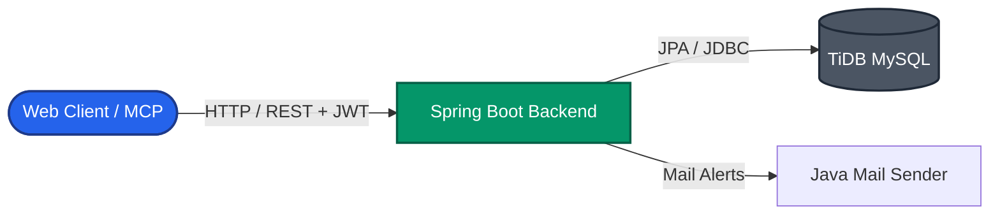

# 🌐 SocietyConnect

[](https://react.dev)
[](https://vitejs.dev)
[](https://spring.io/projects/spring-boot)
[](https://pingcap.com/products/tidb)
[](https://vercel.com)
[](https://render.com)

> **SocietyConnect** is a corporate-grade hyperlocal digital ecosystem that bridges the trust gap between residents, local service providers, and residential communities. Featuring automated trust-score directories, group buying economies, emergency response dispatchers, and integrated wellness productivity panels, it transforms residential spaces into connected networks.

---

## 🌟 Core Value Propositions

### 🏡 For Residents
*   **Verified Marketplace**: Easily find trusted service providers sorted by security background.
*   **Secure Transactions**: Raise disputes and upload transaction screenshots for escrow-like security.
*   **Productivity & Wellness**: Track focus tasks, hydration, mood metrics, and budget planners natively.

### 🛠️ For Service Providers
*   **Reputation Engine**: Build verification stars based on ratings and completed jobs.
*   **Client Communication**: SSE-powered instant messaging to receive dispatch alerts.
*   **SaaS Dashboard**: Design package pricing and manage subscription tiers.

### 🏢 For Community Management (Admins)
*   **System Auditing**: Toggle RWA, identity, and police verifications.
*   **Dispute Arbitration**: Resolve community grievances and manage network parameters.

---

## 📸 Key Features Visual Walkthrough

Below are the primary user dashboards and screens showing the clean, fluid, responsive, and neumorphic layout.

### 1. Neumorphic Interactive Service Directory
The homepage presents residents with a harmonious, accessibility-compliant neumorphic dashboard to search categories, view active bookings, and review nearby recommendations.


### 2. High-Intent Directory Search & Filtering
Our search engine lists verified service providers, filtering by RWA verification status, premium tier level, and ecological practices. All search results are sorted by our dynamic Trust Score.


### 3. Hyperlocal Growth Hub & Group Deals
The startup engine uses network clustering effects: residents can join group-pledges for discounted society-wide deals, while service providers can access the emergency dispatch queue.


### 4. Focus Timer & Wellness Center (Aether Planner)
An integrated daily planner providing a Pomodoro focus timer, timeline schedule, habits tracking grid, hydration manager, and daily budgeting logs.

### 5. Real-Time Chat & Communications
A messaging page powered by Server-Sent Events (SSE) that connects residents with service providers to establish job instructions and confirm ETAs.

---

## 🏗️ Architectural Overview & Design Blueprints

SocietyConnect implements a decoupled three-tier model optimized for cloud-native deployment.



For comprehensive specifications, diagrams, and logic matrices, refer to our detailed blueprints:

*   📘 **[High-Level Design (HLD) Document](docs/HLD.md)**: Exposes full system context diagrams, container mappings, JWT security filter sequences, and tech stack choices.
*   📗 **[Low-Level Design (LLD) Document](docs/LLD.md)**: Exposes the complete MySQL/TiDB Entity-Relationship (ER) diagram, the REST API endpoints listing, and the dynamic Trust Score formula logic.

---

## 🤖 Model Context Protocol (MCP) Server Integration

The platform includes a built-in Node.js **MCP Server** that exposes the Spring Boot endpoints to local AI agents (e.g. Claude Desktop). 

1.  **Get Categories (`get_categories`)**: Exposes active service category folders.
2.  **Search Providers (`search_providers`)**: Allows AI to query provider databases.
3.  **Get Details (`get_provider_details`)**: Fetches ratings, bios, and RWA check documents.

Refer to the [MCP Server Directory](mcp-server/README.md) for Claude Desktop connection parameters.

---

## ⚙️ Development & Local Installation

### Prerequisites
*   **Java 17 SDK** (JDK)
*   **Node.js v18+**
*   **MySQL Client** or **TiDB Account**
*   **Maven 3.8+**

### Step 1: Clone the Repository
```bash
git clone https://github.com/raviattrash-pro/societyConnect.git
cd societyConnect
```

### Step 2: Database Setup (TiDB / MySQL)
1.  Create a MySQL schema named `societyconnect`.
2.  Open [application.yml](backend/src/main/resources/application.yml) and configure your TiDB connection URI and credentials:
```yaml
spring:
  datasource:
    url: jdbc:mysql://YOUR_TIDB_HOST:3306/societyconnect?useSSL=true
    username: YOUR_USERNAME
    password: YOUR_PASSWORD
```

### Step 3: Run the Spring Boot Backend
```bash
cd backend
mvn spring-boot:run
```
> [!TIP]
> The database seeder will auto-create default categories, fake service listings, and an Admin account.
> **Admin Credentials**: Email: `admin@societyconnect.com` | Password: `admin123`

### Step 4: Run the React Frontend
1.  Open a new terminal window in the project root.
2.  Create `frontend/.env` and paste:
```env
VITE_API_BASE_URL=http://localhost:8080/api
```
3.  Install dependencies and launch Vite:
```bash
cd frontend
npm install
npm run dev
```

### Step 5: Launch the MCP Server
```bash
cd mcp-server
npm install
node index.js
```

---

## 🎨 Asset Configuration & Screenshots Setup

To update and copy the latest application screenshots and visual illustrations to the repository:

1.  Execute the node copy script from the root directory:
```bash
node frontend/copy_images.js
```
2.  This copies PNG assets from the AI workspace logs folder directly into the client's public images directory (`frontend/public/images/`) so they render on GitHub.
