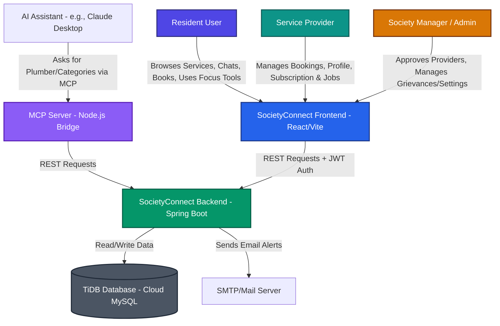
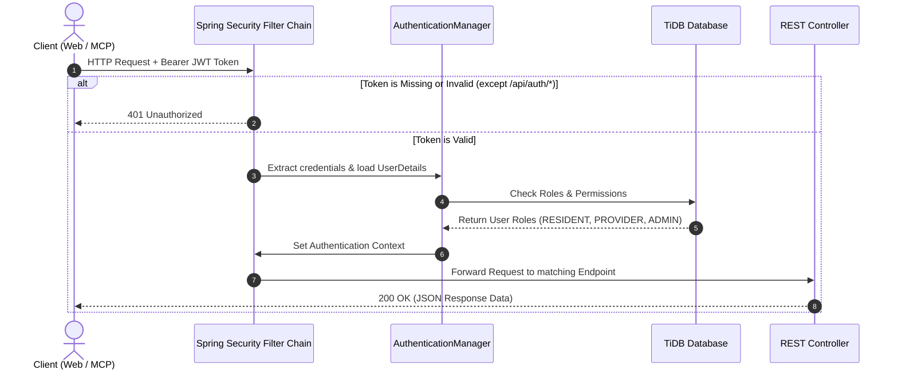

# High-Level Design (HLD) - SocietyConnect

## 1. System Overview & Context

**SocietyConnect** is a hyperlocal community service platform designed to bridge the trust gap between residential communities, local service providers, and administrative managers. By integrating features such as trusted rating systems, group-buying networks, PWA support, emergency dispatch services, and a focus-timer wellness center, the platform serves as an all-in-one hyperlocal digital ecosystem.

### System Context (C4 Diagram - Level 1)



---

## 2. Container Architecture (C4 Diagram - Level 2)

The system consists of three distinct modules cooperating over standard network protocols:

```mermaid
rect rgb(240, 244, 255)
    subgraph Client Tier (Frontend & Agents)
        BrowserClient["Single-Page Application\n(Vite + React / CSS)\n[PWA]"]
        ClaudeDesktop["AI Desktop Agent\n(Claude Desktop App)"]
    end
end

rect rgb(236, 253, 245)
    subgraph Service Tier (API & AI Bridge)
        SpringServer["Spring Boot Backend API\n(REST Controllers & Security)"]
        NodeMCP["MCP Node Server\n(Command Line API Bridge)"]
    end
end

rect rgb(243, 244, 246)
    subgraph Storage Tier (Database)
        TiDBInstance["TiDB Database\n(MySQL-Compatible Serverless DB)"]
    end
end

BrowserClient -->|HTTP / JSON + JWT| SpringServer
ClaudeDesktop -->|JSON-RPC via Standard I/O| NodeMCP
NodeMCP -->|HTTP / JSON| SpringServer
SpringServer -->|JDBC / JPA| TiDBInstance

style BrowserClient fill:#3b82f6,stroke:#1d4ed8,color:#fff
style ClaudeDesktop fill:#ea580c,stroke:#c2410c,color:#fff
style SpringServer fill:#10b981,stroke:#047857,color:#fff
style NodeMCP fill:#8b5cf6,stroke:#6d28d9,color:#fff
style TiDBInstance fill:#6b7280,stroke:#374151,color:#fff
```

---

## 3. Technology Stack & Design Decisions

### Frontend Client
*   **Vite + React.js (v18)**: Chosen for rapid rendering, Hot Module Replacement (HMR) during development, and minimal bundle sizes.
*   **Neumorphic & Framer Motion UI**: Designed with glassmorphic elements, smooth layout transitions, and fluid micro-animations to feel responsive, alive, and interactive.
*   **Vite-Plugin-PWA**: Configured to cache critical static assets so users can install the application on mobile/desktop home screens.
*   **i18next**: Implemented to support locale switching, allowing the platform to serve diverse multi-lingual neighborhoods.

### Backend Server
*   **Spring Boot (v3.2)**: Core framework providing auto-configurations, dependency injection, and integrated security mechanisms out of the box.
*   **Spring Security & JWT**: Implemented to secure all paths under `/api/` with stateless JSON Web Tokens.
*   **Spring Data JPA**: Simplifies database interaction with repository interfaces and SQL generation.
*   **JavaMail**: Used for automatic notifications, seeder recovery alerts, and sending verification codes.

### Database Layer
*   **TiDB Cloud Database**: Serverless MySQL-compatible database. Offers horizontal scaling, transaction consistency, and automatic sharding to handle large volumes of hyperlocal transactions.

### Model Context Protocol (MCP) Server
*   **Node.js Server**: Listens to JSON-RPC messages from Claude Desktop. Exposes three key tools:
    1.  `get_categories`: Lists service categories (Plumbing, Electrical, Wellness, etc.).
    2.  `search_providers`: Searches for nearby service providers using keywords, ratings, or locations.
    3.  `get_provider_details`: Fetches detailed profile statistics, verified documents, and reviews.

---

## 4. Security Architecture

The application enforces strict data segregation using role-based filters.



### Core Security Rules
1.  **Password Security**: All user passwords are encrypted using **BCrypt** hashing with a strength factor of 10.
2.  **Stateless Sessions**: JWT tokens are signed using a HS512 secret key with a default expiry of 24 hours. No session state is held in backend memory.
3.  **Role-Based Constraints**:
    *   `ROLE_RESIDENT`: Can create bookings, review services, update profile, and raise disputes.
    *   `ROLE_PROVIDER`: Can accept bookings, update service details, define ETAs, and charge for subscription packages.
    *   `ROLE_ADMIN`: Full directory control, setting adjustments, dispute resolution, user locking/unlocking, and seeder control.
