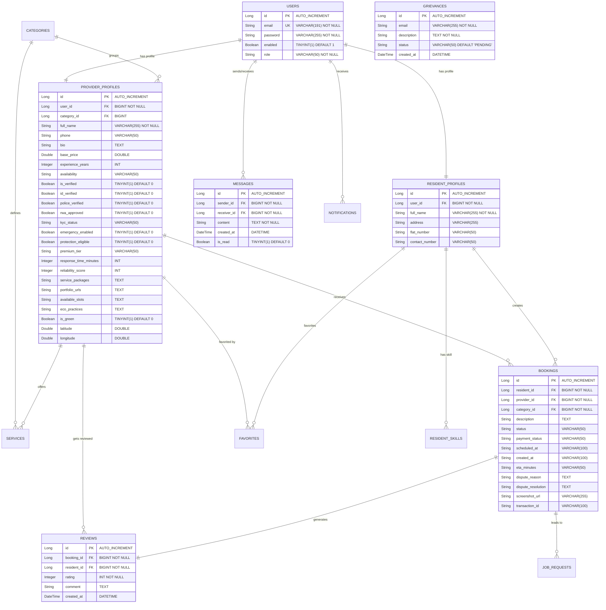
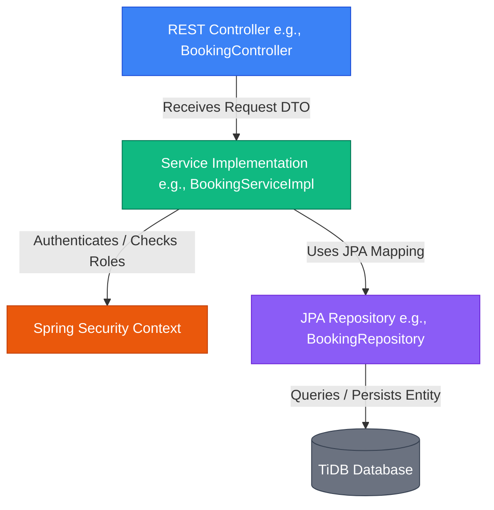

# Low-Level Design (LLD) - SocietyConnect

## 1. Database Schema & Relationships (ER Diagram)

The application uses an Entity-Relationship model stored in **TiDB Cloud**. Key relations are structured as follows:

---

## 2. Table Schemas, Constraints & Indexes

To optimize lookup speeds for hyperlocal searches (which query lat/long, availability, and ratings), the following indexes are defined in **TiDB Cloud**:

1.  **`users` Table**:
    *   `email`: Unique Index (`UK_user_email`) for authentication lookups.
2.  **`provider_profiles` Table**:
    *   `user_id`: Foreign Key (`FK_provider_user`) with `ON DELETE CASCADE`.
    *   Composite index on `(category_id, is_verified, availability)` to accelerate filters.
    *   Composite spatial index on `(latitude, longitude)` for nearby service lookups.
3.  **`bookings` Table**:
    *   Index on `resident_id` & `provider_id` to query history.
    *   Index on `status` and `payment_status` to compute statistics.
4.  **`messages` Table**:
    *   Composite index on `(sender_id, receiver_id, created_at)` to fetch conversation logs in chronological order.

---

## 3. Platform Core Algorithms

### The Trust Score Algorithm (`calculateTrustScore`)
The ranking of service providers in search results is dictated by a dynamic **Trust Score (0-100)**. This prevents bad actors and boosts high-quality providers.

The code in `ProviderController.java` computes the score using the following logic:

$$\text{Trust Score} = \text{Base (35)} + \text{Bonuses} \quad [\text{Capped at 100}]$$

#### Point Distribution Breakdown:
1.  **RWA Verification (`isVerified`)**: **+15 points**
2.  **Identity Verified (`idVerified`)**: **+10 points**
3.  **Police Check Approved (`policeVerified`)**: **+10 points**
4.  **Customer Ratings**: **+ (Average Rating $\times$ 5)** (Max: **+25 points**)
5.  **Customer Engagement**: **+ (Review Count $\times$ 2)** (Max: **+15 points**)
6.  **Completed Jobs Count**: **+ (Job Count $\times$ 1)** (Max: **+10 points**)
7.  **Rapid Dispatch Response**: **+5 points** (If response time is $\le 30$ mins)
8.  **Elite Premium Tier**: **+5 points** (If subscribing to the `ELITE` subscription)

---

## 4. Class Components & Pattern Map

The Spring Boot backend organizes components into a layered structure. A request flows through controllers to services and repositories:

### Component Breakdown & Responsibilities:
1.  **REST Controllers**:
    *   Expose endpoints, read path variables, and enforce authorization annotations (`@PreAuthorize`).
    *   Convert incoming payload into Request DTOs.
2.  **DTOs (Data Transfer Objects)**:
    *   `RegisterRequest` / `LoginRequest`: Inputs to validate request inputs using JSR-380 validation annotations (`@NotBlank`, `@Email`, `@Size`).
    *   `ProviderDetailResponse`: Flat DTO mapping nested properties (Services, Reviews, Trust Scores) cleanly for frontend JSON ingestion.
3.  **Service Implementations**:
    *   Contain transactional business logic (`@Transactional`).
    *   Calculate dynamic variables, update DB entities, compile summaries, and interact with the Java Mail Sender.
4.  **JPA Repositories**:
    *   Define query methods (e.g. `findByServiceProviderIdOrderByCreatedAtDesc`) mapped dynamically to database queries.

---

## 5. Detailed REST API Documentation

All controllers are mapped under the `/api` route prefix. JWT token must be supplied as an `Authorization: Bearer <TOKEN>` header.

### Authentication Endpoints (`/api/auth`)
*   `POST /register`: Registers a new User (Resident or Provider).
*   `POST /login`: Authenticates user and returns JWT Token & profile metadata.
*   `POST /forgot-password`: Generates reset token and triggers mail notification.
*   `POST /reset-password`: Consumes reset token and commits new password.
*   `POST /grievance`: Public endpoint allowing user complaints.

### Booking & Transaction Endpoints (`/api/bookings`)
*   `POST /`: Creates a booking lead (Requires `ROLE_RESIDENT`).
*   `GET /my`: Retrieves authenticated user's bookings list.
*   `PATCH /{id}/status`: Updates status (Pending $\rightarrow$ Accepted $\rightarrow$ En Route $\rightarrow$ In Progress $\rightarrow$ Completed / Cancelled). (Requires `ROLE_PROVIDER` or `ROLE_ADMIN`).
*   `PATCH /{id}/payment`: Uploads dispute screenshots & marks payment completed. (Requires `ROLE_RESIDENT`).
*   `PATCH /{id}/eta`: Updates provider arrival times. (Requires `ROLE_PROVIDER`).
*   `PATCH /{id}/dispute`: Flag booking as disputed. (Requires `ROLE_RESIDENT`).
*   `PATCH /{id}/dispute/resolve`: Admin resolution overrides and payouts. (Requires `ROLE_ADMIN`).
*   `GET /revenue-summary`: Comprehensive platform tax and commission statistics. (Requires `ROLE_ADMIN`).

### User Profiles Endpoints (`/api/profiles`)
*   `GET /me`: Returns profile metadata based on authenticated role.
*   `PUT /resident`: Update Flat, Address, Contact details. (Requires `ROLE_RESIDENT`).
*   `PUT /provider`: Update Bio, Experience, Base rates, Location data, and availability. (Requires `ROLE_PROVIDER`).

### Provider Operations (`/api/providers`)
*   `GET /{id}`: Details provider profile including ratings, reviews lists, packages, and trust scores.
*   `PATCH /location`: Accepts lat/long updates from provider client GPS.
*   `PATCH /business-settings`: Update dispatch variables (`responseTimeMinutes`, `isGreen`, `availableSlots`, subscription packages).

### System Administration (`/api/admin`)
*   `GET /dashboard`: Aggregated platform statistics.
*   `GET /users`: Active user list directory.
*   `PATCH /users/{id}/toggle`: Toggle lock state on user accounts.
*   `GET /providers/unverified`: Lists providers pending background audits.
*   `PATCH /providers/{id}/verify`: Approve RWA background screening checks.
*   `PATCH /settings/{key}`: Adjust system settings keys (e.g. system commission rate, registration windows).

---

## 6. Frontend Component & Routing Map

The frontend React application uses **React Router (v6)**. 

### Page Mappings:
1.  `/login` & `/register`: Clean card interfaces using local validation states.
2.  `/`: HomePage router redirecting users to matching role panels.
3.  `/search`: Fluid filters listing verified providers by search query, filters (verification, green badge, premium tier), and sorted by Trust Score.
4.  `/provider/{id}`: Public provider profile detailing reviews timeline, available bookings calendar, and services.
5.  `/messages`: SSE/WebSocket real-time chat dashboard showing active resident-provider chats.
6.  `/growth-hub`: Platform business summary detailing verification moats, active group deals, and emergency contact list.
7.  **Dashboards**:
    *   `/resident-dashboard`: Track active jobs, dispute filings, payment receipts, and bookmark collections.
    *   `/provider-dashboard`: Subscription panels, bookings dispatcher, map updates, and package designer.
    *   `/admin-dashboard`: Dispute audits list, verification toggle queues, settings managers, and revenue dials.
